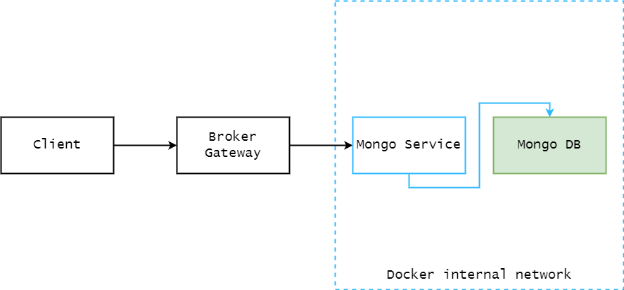
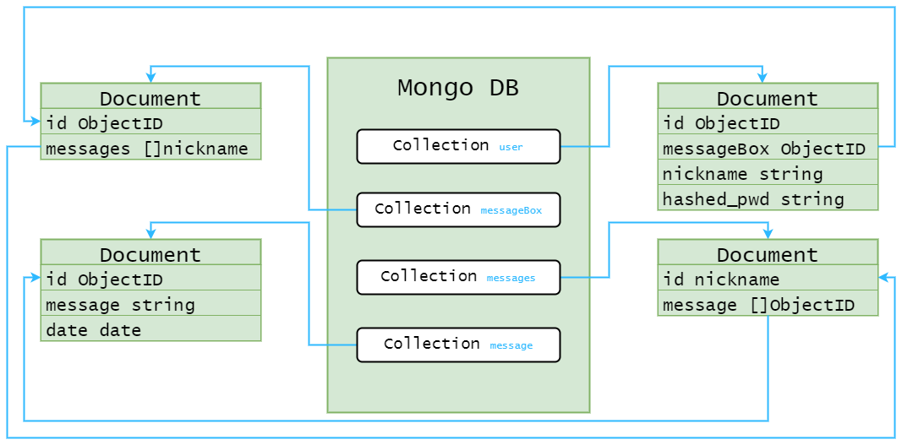

# Messanger

Messanger is a POC project based on microservice architecture inspired by [Telegram](https://en.wikipedia.org/wiki/Telegram_(software)).  
The most basic things from each messanger are present here:
- Register in the web app.
- Find your friends by nickname.
- Message each other with a straight forward UI.
## Project architecture

Project is built from four pods:  
1. `Client` - NodeJS based app with ejs view engine.
2. `Broker Gateway` - Golang TCP server + message converter.
3. `Mongo Service` - Golang Mongo DB wrapper API which simplifies working with database.
4. `Mongo DB` - instance of Mongo running in the separate container.
   -  Note: both `Mongo Service` and `Mongo DB` pods are configured in the internal network, you can't access them externally.
## Database architecture
